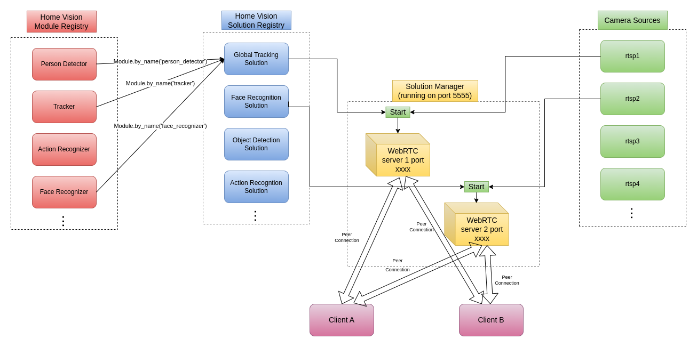

# HomeVision

Welcome to HomeVision, unlock the full potential of your security cameras with YOLOv8 and WebRTC!

Transform your live video feeds into intelligent streams that detect, analyze, and respond to critical events in real-time.

Perfect for home security, commercial surveillance, and beyond. It empowers you to monitor your property like never before.

## Features

- High-quality video streaming: Enjoy seamless, high-definition multiple source video streaming with minimal lag and interruption.

- Cross-platform compatibility: The package is designed to work with a variety of platforms and devices, including web browsers, mobile devices, and more.

- Real-time processing: Pre-configured with popular computer vision solutions such as object detection and tracking, face recognition, and more.

- Scalability: Our package can easily be scaled to meet the needs of any project, from small-scale applications to large-scale enterprise deployments.

- Customizable: Enables developers to test and experiment with computer vision solutions on real-time RTSP streams without the hassle of setting up their own infrastructure.

# Installation

To install HomeVision, follow these steps:

1. Clone the latest repo
2. Install dependencies by:
 `pip install -r requirements.txt pip install -e .` or `poetry install`

# Usage

First download models by running `./download_models.sh`

## Restream RTSP
Once you have installed HomeVision, run `python solution_manager/main.py` and follow UI to run the computer vision algorithm on the RTSP stream you want.

Add camera from `add camera` button on UI or change the `solution_manager.yaml` config file.

API doc follow the http://localhost:5555/docs

## Run local video file
run `python demo/run_video.py`

## Docker

- `git clone https://github.com/microsoft/onnxruntime.git`
- Follow instructions [here](https://github.com/microsoft/onnxruntime/tree/master/dockerfiles/#CUDA) to build image `onnxruntime-cuda`
- run `sh docker.sh` to build and run docker

## Testing
run `pytest`